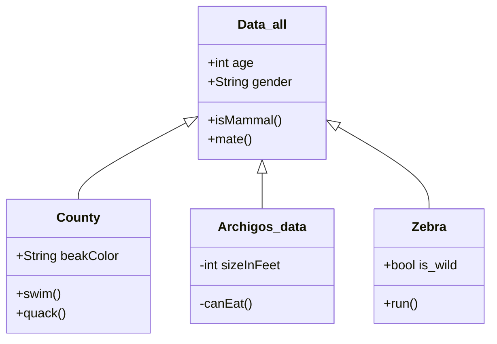

# code for Shuai Zhao's paper of Analysing Political Executives With AI data processing

## data processiong

need one plot for the data processiong.

```mermaid
classDiagram
    Data_all <|-- County
    Data_all <|-- Archigos_data 
    Data_all <|-- Zebra
    Data_all : +int age
    Data_all : +String gender
    Data_all : +isMammal()
    Data_all : +mate()
    class County{
      +String beakColor
      +swim()
      +quack()
    }
    class Archigos_data {
      -int sizeInFeet
      -canEat()
    }
    class Zebra{
      +bool is_wild
      +run()
    }
            
```

## AutoGluon